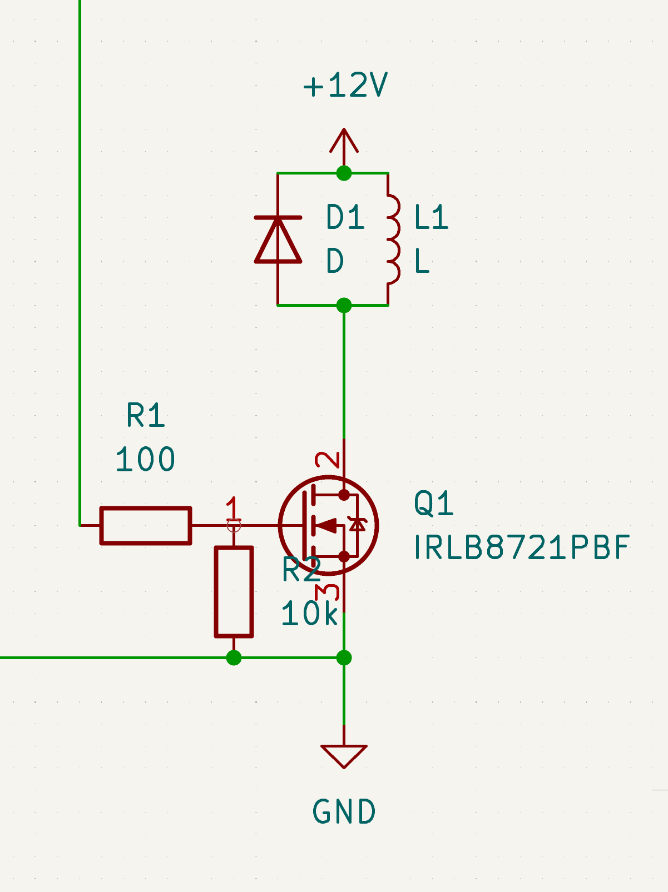
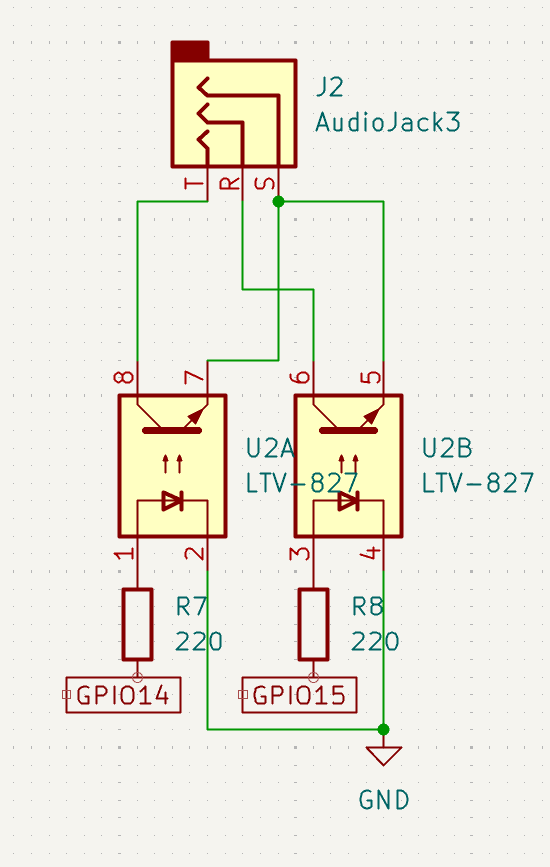
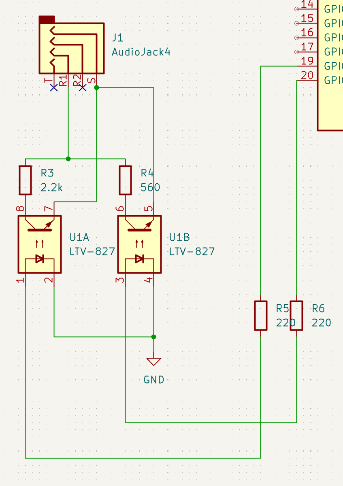

# 装置と電子回路

## 水滴落下のためのソレノイドバルブ

* 水を使えるソレノイドバルブでDC12Vくらいのもの。ノーマルクローズドタイプで電流を流す間だけ開くので、電流を流す時間で水滴の量を調整できる。
* 水タンクとチューブで接続する。タンクの上部は密閉して穴をあけ、チューブを通してマリオット瓶にしておくと、水圧を一定に保てる。
* マイコンは大きな電流を流せないので、トランジスタをマイコンでドライブする形にする。コイルの逆起電力があるので、ダイオードを電流と逆向きに接続する。ソレノイドに流れる電流でトランジスタを選定する必要がある。楽をしたかったらタカハ機工のソレノイド制御基板がある。
* トランジスタの型番 2SC3421 (MOSFET IRLB8721の方が反応速度や発熱で有利か)
* ソレノイドバルブの型番 SMC VDW22GZ1D: 12VDC, 反応速度が遅く、1滴落とそうとしても、数滴落ちるケースがある。
* フライバックダイオード　逆起電力によるマイコンの保護　1N4007など

## カメラとの接続

* フォトカプラを使ってシャッターの半押し、全押しに相当する端子を導通させる。マイコンのGPIOをHIGHにすると、フォトカプラのLEDに電流が流れ、フォトトランジスタ側が導通してシャッターを押すことができる。マイコンに流せる電流を考慮してフォトカプラの型番とLEDの電流制限抵抗を選定する。
* フォトカプラの型番 TLP785など。LED側は制限抵抗のみでGPIOとGNDに接続、フォトトランジスタ側はカメラのリモート端子と接続。半押しと全押しで2回路必要。

## 台

* 2020アルミプロファイルを使用して台を作り、水タンクとソレノイドを固定するアームを台に固定した。固定のための部品は3dプリントで自作した。

## マイクロコントローラ

* Arduino と raspberry pi pico を試した。
* GPIOの電圧はArduinoは5V、picoは3.3Vであり、流れる電流が異なるが、どちらでも使えた。
* コーディングの違い
   * Arduinoは国内でもかなり普及しているが、C++でコードを書き、コンパイルしてアップロードする必要があり、敷居は高め。
      Arduino IDEを使うことで、MCUによらず同様なコードでsetup, loop関数だけを書く。実際には特定のGPIOをHIGH,LOW
      に設定し、delay_ms()で時間稼ぎをするだけなので、コーディングは楽な方である。水の通過をフォトインタラプタセンサーで検出してトリガーさせる場合は割り込みが必要で、やや難易度が上がる。
   * PicoはPythonで書くことができ、ThonnyというIDEを使用。
      コンパイル不要なので、数値をかえてすぐ実行できる。終了時に初期化されないので、try で異常終了した場合の例外処理が必要。コイルに電流が流れっぱなしになることがあった。
      生成AIでコードを互いに翻訳することもできる。
